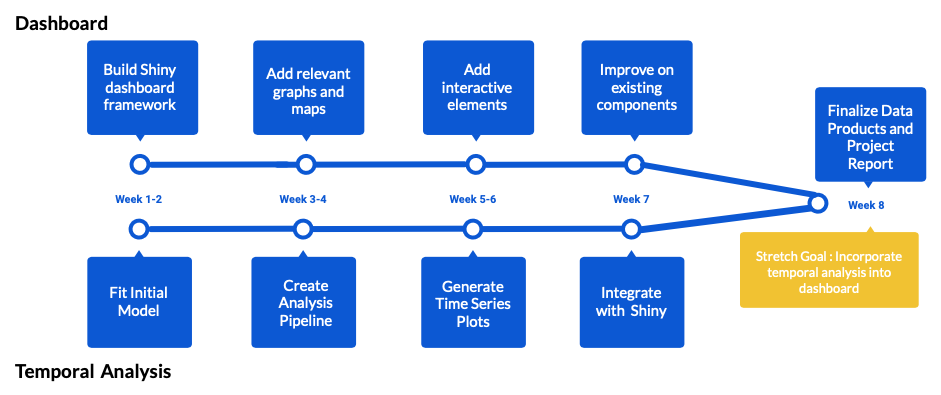

```{r global_options, include=FALSE}
knitr::opts_chunk$set(fig.pos = 'H')
```
\newpage

# Executive Summary 
The Chronic Disease Registry is a data product that captures information about the 
rate of new and persistent cases of chronic diseases in each CHSA (Community Health Service Area), 
as well as demographic information such as sex and age standardized rates.
In this project we aim to create an interactive dashboard that will allow users 
of all technical expertise to explore and visualize spatiotemporal information of the disease rates in the data,
and to develop an analysis pipeline that will describe the temporal trends in the data. 
This proposal will outline the approach we will take to tackle this problem and achieve the project goals.

\newpage

# Introduction 
Millions of people in BC live with a chronic disease, so it's important to understand 
and interpret the distribution of disease prevalence throughout the province for a variety of reasons.
We may want to know how to best allocate healthcare resources, 
or to identify if a specific region is experiencing rapid growth of a disease. 
The dashboard is a tool that will allow healthcare professionals 
and eventually the general public to access the disease information and answer these questions.  

The Chronic Disease Registry has 3 different types of rates that we will be incorporating into our data product.
Incidence Rate is the rate at which new cases occur in a specified population during a specified time period;
Lifetime Prevalence is the proportion of individuals who have had the condition for at least part of their lives, 
and Active Healthcare Contact Prevalence are the cases for which a patient seeks healthcare services for relapsing - remitting conditions. 
For each disease rate metric, the data is stratified by region at multiple tiers. 
In this project we will focus on the 5 Health Authorities (HA) and the 195 Community Health Service Areas (CHSA).

## Dashboard
To visualize the spatial and temporal trends of disease rates in the province, 
we will build an interactive dashboard that will allow users to compare 
the rates of various diseases in one specific health region over time,
as well as to compare how the rates of one disease has varied across several health regions over time. 
The users will be able to compare between HAs or between CHSAs.
We also plan to create an information page in the dashboard 
containing definitions and descriptions of variables and diseases to increase usability for less technical users. 
Lastly, we will have a page displaying the data table with filters applied, 
with the option to download the data as a report.
A sketch of the proposed dashboard design is shown below in Figure \@ref(fig:dashboard).

``` {r dashboard, echo=FALSE, fig.cap="Proposed Dashboard Design Layout. The dashboard will consist of 4 tabs: a disease-specific tab, a region-specific tab, an information tab, and a download tab.", out.width = '100%'}
knitr::include_graphics("images/dashboard.png")
```

## Temporal Modeling
The Office of BC Provincial Health Officer curates data of ongoing surveillance of 25 Chronic Diseases 
throughout the whole region (British Columbia province). 
Currently the dataset has data on Incidence Rate, Prevalence Rates, Geographical and administrative geo-tiers and age-groups. 
To observe the trend of changes throughout the years of such surveillance data, 
temporal analysis is the standard choice. 
We will explore various methods as per nature of data, established evidences, stakeholder discussions and variables of interest. 
Eventually, the outputs will be incorporated with the primary R Shiny app. 

# Data Science Techniques
Several different data science tools and techniques will be used throughout the project to accomplish the project deliverables. 
Some tools are familiar to the team, while others tools we will need to learn. 
The tools and techniques for each aspect of the project are described in this section.

## Dashboard
We will be using R Shiny to build the framework of the interactive dashboard, 
and we will be utilizing the leaflet and ggplot packages to assist in creating visually appealing graphs and maps. 
For data wrangling we will use the tidyverse set of packages to tidy the data in preparation for plotting.    

## Temporal Modeling
We will use a Bayesian temporal smoothing model for the inferential analysis 
of chronic disease incidence and prevalence over time. The goal of this model is
to generate smoothed estimates with smaller intervals for CHSAs with small populations.
A Bayesian approach was selected in order to integrate prior knowledge 
about the disease rates and to generate 95% credible intervals from the posterior distribution. 
We propose to use the INLA package for Bayesian analysis for computational efficiency 
compared to traditional MCMC approaches. (@gomez-rubio_2021)

Temporal smoothing is appropriate for our data due to the autocorrelation 
that is observed between disease incidence and prevalence rates
from sequential time points in a given region.
For each disease, we will compare 2 temporal smoothing models for each of the 
3 standardized disease rates: a first-order random walk model (RW1) 
and a second-order random walk model (RW2).
A RW1 model will smooth towards the previous value and penalize deviations from its neighbour,
whereas a RW2 model will smooth towards the previous slope and penalize deviations from linearity. 
Therefore, a RW2 model will produce a greater smoothing effect than an RW1 model. (@wakefield)

As a baseline, we will compare our Bayesian smoothing models to the 
95% confidence intervals created using frequentist approaches provided in our original dataset.
If the Bayesian 95% credible intervals produced are smaller overall than the 95% 
confidence intervals, we will select a final model among the RW1/RW2 approaches.

To determine our final model, we will use the Deviance Information Criterion (DIC) 
and the Widely Applicable Information Criterion (WAIC), 
where a smaller DIC/WAIC indicates a better fit. 
The final model determined for a given disease and metric will then be fit 
on all CHSA regions. Time series plots will then be generated with
both observed and modeled disease incidence/prevalence rates for the Shiny app.

# Timeline

We will form two sub-teams to work in parallel to develop the two final deliverables. 
The milestones descriptions and respective target week of completion for each sub-team are showed below in Figure  \@ref(fig:timeline).

``` {r timeline, echo=FALSE, fig.cap="Timeline of Capstone project milestones. Two teams will work in parallel to develop the Shiny dashboard and temporal models over 8 weeks and produce the final data products and reports by June 29.", out.width = '100%'}

```

# Conclusion
Each year, the Office of British Columbia Provincial Health Officer tracks 
persistent and new cases of 25 chronic diseases throughout the whole region. 
This document has proposed methods to accommodate the possible inquiries 
about the prevalence of chronic conditions and their spatiotemporal trends from health professionals and non-experts. 
The proposed methods include: 
(1) an interactive and informative dashboard using R Shiny 
for users to visualize the distribution of diseases with filters for measure, disease, sex, and health authority regions, 
and (2) a data analysis pipeline using the Bayesian temporal smoothing model 
to infer and display temporal trends of diseases in the dashboard. 
Two sub-teams will work in parallel to develop the final products for each method in 8 weeks (Figure \@ref(fig:timeline)). 
The project will include a formal presentation on June 16 and a final report on June 29.

# References