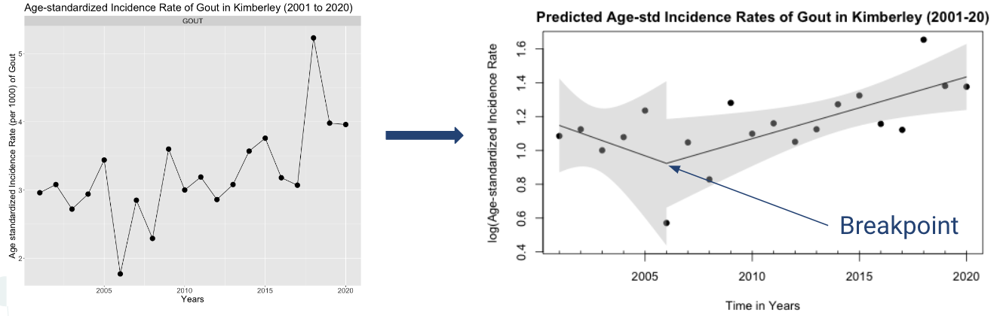
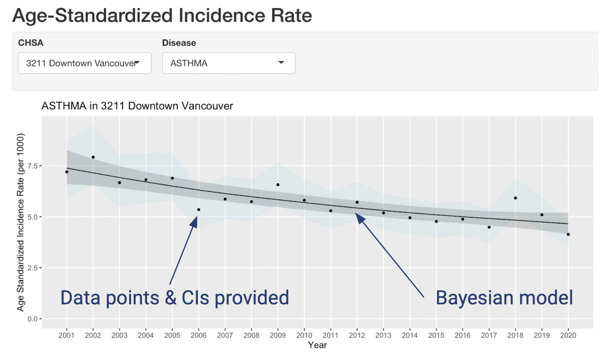
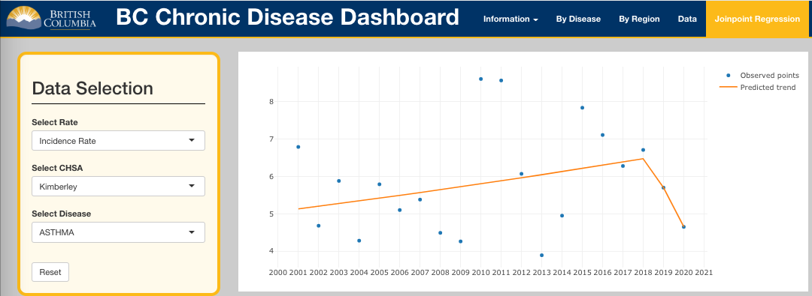

```{r global_options, include=FALSE}
knitr::opts_chunk$set(fig.pos = 'H')
```

\newpage

# Executive Summary

The BC Chronic Disease Registry (BC CDR) is a data product that captures
information about the rates of new and persistent cases of 25 different
chronic diseases across the Province of British Columbia. Crude and
age-standardized rates of disease are recorded for different health
boundary types, including HAs (Health Authorities) and CHSAs (Community
Health Service Areas), as well as for demographic variables such as sex.
In this project we aim to develop an analysis pipeline to describe the
temporal trends in the data, and then build an interactive dashboard
that will allow users of all technical expertise to explore and
visualize spatial and temporal information of the disease rates. This
report will outline the approach we took to tackle this problem and a
description of our final data product.

\newpage

# Introduction

Millions of people in BC live with a chronic disease, so it is important
to understand and interpret the distribution of diseases throughout the
province for a variety of reasons. We may want to know how to best
allocate healthcare resources, or to identify if a specific region is
experiencing rapid growth of a disease. The dashboard is a tool that
will allow healthcare professionals and eventually the general public to
access the disease information and answer these questions.

The BC CDR captures three different types of rates that we will be
incorporating into our dashboard: incidence rate, lifetime prevalence
rate, and active healthcare contact prevalence rate. Incidence Rate is
the rate at which new cases occur in a specified population during a
specified time period; Lifetime Prevalence is the proportion of
individuals who have had the condition for at least part of their lives,
and Active Healthcare Contact Prevalence are the cases for which a
patient seeks healthcare services for relapsing-remitting conditions.
Each of these three rates are available as crude or age-standardized
rates. Age-standardized rates are adjusted to the standard population,
and are calculated as if all regions shared the same age structure, that
of the 2011 Canadian Census. Crude rates are not adjusted to the
standard population, and represent the number of cases in a specific
geographic region divided by the population at risk in that region. For
each disease rate metric, the data is stratified by year, sex and by
region at various tiers. In this project we focus on the least and the
most granular health boundaries, which are the five Health Authorities
(HA) and the 195 Community Health Service Areas (CHSA).

## Dashboard

The dashboard facilitates the exploration and visualization of spatial
and temporal trends of 25 different chronic diseases across the Province
of British Columbia. The dashboard consists of 4 main tabs, which are
Information, By Disease, By Region, and Data. The Information tab
contains a description of the dashboard usage, and definitions of rate
types, diseases, and data variables. The By Disease tab allows for the
comparisons of one disease over several HAs or CHSAs, while the By
Region tab allows for the comparisons of several diseases in one
particular HA or CHSA. The Data tab retrieves and displays all data
specified by the user, and contains a button to download the data if the
user wishes to do so.

## Temporal Modelling

To help interpret chronic disease trends across the province, we
generated models to smoothen disease rate estimates at the most granular
health boundary, the CHSA, since estimates from smaller communities can
have large fluctuations and confidence intervals. We selected a Bayesian
modelling approach and a local polynomial regression (LOESS) model to be
fit on data over 20 fiscal years from each combination of disease, CHSA,
and age-standardized rate type. These temporal models were integrated
into the final dashboard to allow users to easily compare chronic
disease rates and trends between different CHSA.

## Joinpoint Regression

Segmented or broken-line models are regression models where the
relationships between the response and explanatory variable are
piece-wise linear, namely represented by two or more straight lines
connected at unknown values: these values are usually referred as
breakpoints, change-points or even join-points. Here the response
variable are different standardized chronic disease rates, and time in
years (2001 to 2020) being the explanatory variable. Broken-line
relationships are common in many fields, including epidemiology,
occupational medicine, toxicology, and ecology, where sometimes it is of
interest to assess threshold value where the effect of the co-variate
(time in years) changes [@ulm1991statistical; @betts2007thresholds]. In
other words, this model is used here to estimate abrupt changes in rates
in particular points in time, rather than smoothing it. The idea is to
aid epidemiologists in drawing inferences by estimating these
change-points.

# Data Science Techniques

Several different data science tools and techniques were used throughout
the project to accomplish the project deliverable and are described in
this section.

## Dashboard

While the majority of the dashboard was built using R, several other
languages were also needed in order to customize and run the dashboard,
including JavaScript, HTML, and CSS. R was used to build the Shiny App
framework, as well as for all of the data wrangling, processing, and
plotting. Javascript was needed to create customized functions that were
otherwise impossible in R, such as for the map animation in the By
Disease tab. Some Javascript components were also needed to optimize the
processing speed of the app. HTML was used for text formatting and other
styling options throughout the dashboard, including on the Information
pages, in the plot hover labels, and the plot legends. CSS was needed
for reusable customized styling, and streamlined the style modification
process in the dashboard. Much of the element layouts, colours, and
spacing were achieved through the use of CSS.

Nearly 15 different packages were used to create the dashboard, with the
most important ones being Shiny, Leaflet, and Plotly. Shiny was used to
build the overall app framework, and was a requirement on part of the
Capstone Project. Leaflet was used to create the interactive map on the
By Disease tab, and was chosen due to its easy integration with Shiny
and Plotly. However, the difficulty with using Leaflet is that it does
not easily animate within R and Shiny, and thus the custom Javascript
functions were needed in this case. Plotly was used to create the
interactive plots in both the By Disease and By Region tab. This
plotting library was preferred over other options such as ggplot because
of its built-in interactive components, and its ability to create smooth
animations via proxies.

## Temporal Modelling

For temporal modelling, we selected the Integrated Nested Laplace
Approximation (INLA) approach for Bayesian modelling. INLA is faster
compared to Markov Chain Monte Carlo simulation-based methods
(@wang_2018), and since there were over 10,000 combinations of CHSAs,
diseases, and rates to be modelled, computational speed was a key
consideration. Potential disadvantages of INLA include that small
variations between repeated runs can occur as a trade-off for the faster
computation gained by using multiple cores (@wang_2018). However, these
small variations are well beyond the significant digits of our data,
therefore, we considered this to be an acceptable trade-off.

With INLA, we used a Gamma generalized linear model to smoothen the
age-standardized rate, which is a continuous, positive response. The
effect of year was modeled using a Random Walk prior to account for
temporal autocorrelation. On each CHSA, disease, and rate, a first-order
random walk (RW1) and a smoother second-order random walk (RW2) model
was fit. The best RW model was selected using the Widely Applicable
Information Criterion (WAIC).

A limitation of this Bayesian approach was that rare diseases with low
incidence and prevalence rates could not be modelled, because the Gamma
distribution does not provide support for values of 0. This most
frequently affected small communities and rare diseases, such as
juvenile arthritis, multiple sclerosis, and rare forms of stroke.
Despite this limitation, our Bayesian smoothing model could be applied
to 91% of the data, and more specifically, 84% of incidence rate data,
91% of HSC prevalence rate data, and 98% of life prevalence rate data.

On the remaining 9% of the data containing zeroes, the local polynomial
(LOESS) regression baseline model was fit for smoothing. The LOESS
regression is a weighted least-squares regression method that considers
neighbouring points within a given span. The span was automatically
optimized for each set of data using the `fANCOVA::loess.as()` function.

Alternative approaches that were explored to accommodate the data with
zero values were to use the Tweedie distribution, which can accommodate
positive continuous data with a point mass at zero (@kurz_2017).
However, the implementation of the Tweedie distribution in R-INLA
remains experimental and subject to change, and was not further pursued
due to reproducibility concerns. Secondly, zero-inflated Gamma and
hurdle Gamma models were also investigated to accommodate zero values,
but were not supported by R-INLA at this time. Lastly, modification of
the zero values into small non-zero values (0.0001) was explored to be
used within the Gamma model, however, the RW1 and RW2 models did not
demonstrate a suitable level of smoothing after this modification.
Further adjustment of the priors and the scaling of the INLA model may
be required, but were not further explored due to time constraints.

## Joinpoint Regression

Often the relationship between the response and explanatory variables is
non-linear, where it can be seen that the effect on the response changes
abruptly. In case of describing effect of time upon disease rates,
epidemiologists are usually interested in the break-point location and
the relevant regression parameters. The classical methods used to take
into account non-linear effects, such as polynomial regression,
regression splines and non-parametric smoothing, are not suitable
because the change-points are fixed *a priori* (regression splines) or
are not considered at all (smoothing splines and polynomial regression).
Moreover, regression parameters obtained in regression splines or
polynomial regression approach are not directly interpretable
(@rj1990generalized). The `R` package, `segmented`
(@muggeo2008segmented) is capable to account for the unknown
breakpoints, and providing fitted values.

We used `segmented.lm` function from the `segmented` package on data
consisting of the chronic disease rate over time and CHSA. We performed
log-linear regression considering rates as response and time as
explanatory variable, then applied the `segmented.lm` function, which
gave us fitted estimates, and when plotted shows us the desired
breakpoints. A plot from the fitted values of estimated age-standardized
incidence rate of Gout in Kimberley CHSA is shown below.

```{r jp-method, echo=FALSE, fig.cap="Estimated Age-standardized incidence rate of Gout in Kimberley", out.width = '100%'}

```

Model diagnostics defining how well the data fits the model can be
explained by Average Annual Percent Change (AAPC), which is the weighted
average of the change in slopes at each join-points between the
segmented lines.

# Data Product and Results

The design and intended use of the final dashboard data product,
integrating the results from both temporal modelling and joinpoint
regression, is described in this section.

## Dashboard

The dashboard allows the flexibility for the user to explore and
visualize spatial and temporal data of 6 disease rate metrics, for a
unique selection of diseases, health boundaries, sex, and year. With the
various tabs, the user can make appropriate comparisons as needed to
address specific research questions, and can easily visualize temporal
trends through animations of multiple data visualizations over time.

The homepage of the dashboard is `About` page of the Information tab,
which describes the usage and features of the various tabs on the
dashboard. The Information tab consists of three other pages, which
include information and definitions of Rate Types, Diseases, and a Data
Dictionary. An image of the Information tab is shown below in Figure
\@ref(fig:info-tab).

```{r info-tab, echo=FALSE, fig.cap="Homepage of the dashboard showing four pages in the `Information` tab", out.width = '100%'}
knitr::include_graphics("images/info_tab.png")
```

On the By Disease tab, a user can select a single disease and rate type
of interest, multiple health boundaries within a single health boundary
type, and a single sex and year. The dashboard subsequently displays
four summary statistics about the chosen disease, a choropleth map
showing the disease rate over the selected health boundary type, along
with a bar chart showing the rate and confidence intervals of the
disease rate for the selected health boundaries, and a line chart
showing the change in the disease rate of the selected health boundaries
over time. Additional information is displayed upon hover on any of the
plots. The layout of the By Disease tab is shown below in Figure
\@ref(fig:disease-tab).

```{r disease-tab, echo=FALSE, fig.cap="Layout of the `By Disease` tab of the dashboard, showing summary statistics, map, and two graphs.", out.width = '100%'}
knitr::include_graphics("images/disease_tab.png")
```

On the By Region tab, a user can select a single health boundary within
either of the health boundary types, multiple diseases, a single rate
type, sex, and year. The dashboard will then display a bar chart of the
disease rate and confidence intervals for the selected diseases, and a
line chart showing the change in disease rates of the selected diseases
over time. The top 4 diseases with the highest rate in the selected
health boundary are also displayed. The layout of the By Region tab is
shown below in Figure \@ref(fig:region-tab).

```{r region-tab, echo=FALSE, fig.cap="Layout of the `By Region` tab of the dashboard, showing two graphs, and the top four diseases in a given region.", out.width = '100%'}
knitr::include_graphics("images/region_tab.png")
```

On both the By Disease and By Region tab, a toggle switch appears above
the line chart when modelled data is available, which allows the user to
quickly switch between raw data and smoothed time trends. A permanent
toggle switch is also present above the line chart that controls whether
the y-axis starts from 0 or is adjusted to the range of the data. This
customization allows the user to better understand how a disease rate
changes over time based on their needs.

Lastly, the Data tab allows a user to select data on multiple diseases
and health boundaries, and download the data for further analysis. The
layout of the Data tab is shown below in Figure \@ref(fig:data-tab).

```{r data-tab, echo=FALSE, fig.cap="Layout of the `By Region` tab of the dashboard, showing two graphs, and the top four diseases in a given region.", out.width = '100%'}
knitr::include_graphics("images/data_tab.png")
```

The creation of this dashboard has the potential to streamline health
data extraction and interpretation for epidemiologists and other health
professionals, and will increase public awareness of chronic diseases
when it is eventually made public. Future improvements that could be
made to the dashboard are to increase the processing speed of the
dashboard when new data is selected and visualizations are recalculated
and reloaded. The dashboard currently runs at an acceptable speed
locally, but if the app were to be publicly deployed in the future,
there may be some usage concerns regarding loading time. The current
start up time of the app is also considerable, because the app needs to
read in and wrangle the data in every new session. This issue can be
eliminated in the future when the data is made public, since the data
can be wrangled once, and the pre-processed data can be safely stored on
a server.

## Temporal Modelling

In total, 11 956 temporal models were generated at the CHSA level and
made available to explore within an R Shiny document. An R Shiny
document was selected for visualization due to the large number of
models, which made it challenging to display at an individual level in
other static report formats. The R Shiny document visualizes the
original observations, 95% confidence intervals, as well as the selected
model (Bayesian or LOESS) as shown in Figure \@ref(fig:temporal-shiny).
This data product allows data scientists and epidemiologists to visually
inspect and assess the fit of the selected models at a more in-depth
level compared to the final dashboard product, which is targeted towards
a wider audience. For the general audience, the smoothened time trend
models were integrated into the dashboard using a toggle switch, as
described in the Dashboard section above.

```{r temporal-shiny, echo=FALSE, fig.cap="Fitted temporal models displayed in an R Shiny document. The document allows users to explore the 11 956 fitted models (black lines) from the three rate types relative to the original observations (black points) and 95 percent confidence intervals (blue bands). Grey bands indicate the 95 precent credible intervals when the selected model is Bayesian Random Walk 1 (RW1) or Random Walk 2 (RW2), or the 95 percent confidence intervals when the selected model is local polynomial regression (LOESS).", out.width = '100%'}

```

## Joinpoint Regression

The Joinpoint Regression tab of our R Shiny app plots the fitted
estimates from the model and also the original data point over a period
of 2001 to 2020. There are filters for choosing the Standardized Rate
(Response), the Disease, and the CHSA. Toggling these selections, the
user can visualize the breakpoints, and also how it reflects the
original distribution. In the following Figure \@ref(fig:jp-shiny), the
dash board is showing the estimated Age-standardized Incidence Rate of
Asthma in Kimberley CHSA for the period of 2001 to 2020.

```{r jp-shiny, echo=FALSE, fig.cap="Layout of the `Jointpoint Regression` tab of the dashboard", out.width = '100%'}

```

# Conclusion and Recommendations

Every year, the Office of British Columbia Provincial Health Officer 
analyzes British Columbians' healthcare utilization pattern and 
aggregates counts and rates of 25 chronic conditions by time, location, and sex. 
For this project, they sought for two well-defined deliverables: 
an interactive data visualization Shiny app and spatio-temporal analysis tools 
to interpret trends in the data, which we successfully produced. 

First, we build an Shiny dashboard that allows health professionals 
and non-experts alike to explore the distribution of diseases. 
It is fully interactive, user-friendly, visually appealing, 
and consistent with the BC government's color scheme. 
Additional interactivity, such as hover information and linked highlighting effects, 
enrich the user experience. Secondly, we generate models to interpret the temporal trends. 
We use a Bayesian modelling approach to smoothen the large fluctuations 
in estimates from smaller health communities. 
We also apply the local polynomial regression (LOESS) model 
as an alternative to fit the data for low rate diseases. 
The smoothened temporal trends are incorporated into the dashboard for users to easily compare trends.
Finally, we explore join-point regression, which provides epidemiologists 
with information on abrupt rises and falls in temporal trends. 
The model's limitations being that it is sensitive to missing values and diseases with stationary rates.

While we attempted to perfect the deliverables based on constant partner feedback, 
due to the short time frame of this capstone project,
we acknowledge our limitations on and provide recommendations on future endeavors. 
For the dashboard, the main improvement lies in the speed. 
The performance is acceptable for a single user per session, though varies greatly by laptops. 
In the case that multiple users will be active simultaneously, 
asynchronous programming can be applied to increase scalability. 
More details on how to speed up the Shiny dashboard can be found in the project repository. 
To improve the Bayesian approach, additional fine-tuning of the model priors
and scaling of the random walk model with the modified zero Gamma model is recommended.
For the joinpoint analysis, its potential can be extended if 
including other covariates such as sex, socioecnomic status, and other confounders. 
Consideration of regional hierarchy and spatial components would also make the model more robust. 

Overall, we are confident that our data products fit the partner's initial needs 
and will be useful to inform the Ministers and the general public 
on chronic diseases and public health issues.

\newpage

# References
